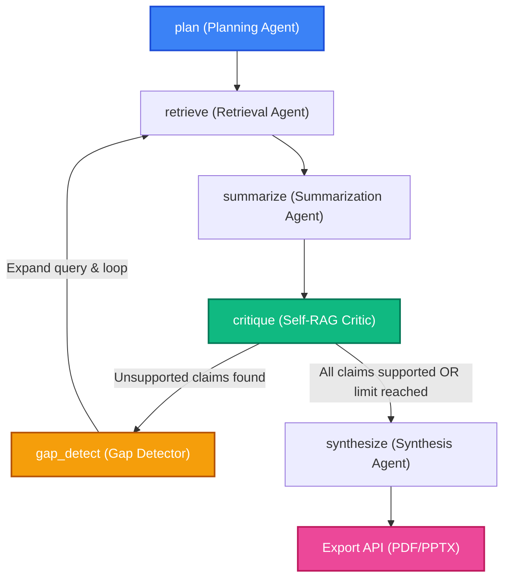

# 🔬 ResearchMate — Autonomous AI-Powered Literature Review Assistant

> **Self-RAG Powered · Zero-Hallucination Verification · Dynamic Citation Graph · Automated PPTX & PDF Reports**

ResearchMate is a fully autonomous academic research assistant that transforms a single research query into a comprehensive, verified literature review. Driven by a state-of-the-art **LangGraph workflow** and a sentence-level **Self-RAG verification engine**, it gathers, analyzes, critiques, and maps academic sources without structural hallucinations.

---

## 📸 UI Showcase & Visual Experience

Every visual aspect of ResearchMate is crafted with sleek, high-fidelity **glassmorphic design systems**, deep space gradients, and premium micro-interactions.

### 1. Main Dashboard & Workspace Layout


### 2. Live Literature Review Canvas


### 3. Interactive Force-Directed Citation Network


---

## 🧠 System Architecture & Workflow

ResearchMate operates as a **coordinated agentic network** orchestrated via a LangGraph state machine. It prevents academic hallucinations by checking every claims list against harvested papers.

### The Unified State Graph


---

## 🔬 Deep Dive: Self-RAG & Hallucination Defense

Standard LLMs suffer from "imagined citation" patterns. ResearchMate actively intercepts this via a multi-phase verification loop:

1. **Extraction**: The **Summarization Agent** drafts an initial literature review.
2. **Analysis**: The **Self-RAG Critic** parses the draft sentence-by-sentence.
3. **Verification**: For every claim, the critic searches the harvested paper database using semantic keyword overlap algorithms.
4. **Auto-Binding**: If a claim matches the bibliography but lacks a tag, the critic **auto-binds** it and injects a `[cite:paper_id]` badge. If it is unsupported, it's flagged as a **citation gap**.
5. **Active Query Expansion**: The **Gap Detector** reformulates search queries for those exact gaps, sending them back to the retrieval harvesters to gather missing evidence.
6. **Softening**: The **Synthesis Agent** compiles the final paper, automatically toning down or rephrasing any remaining claims that couldn't be strictly verified.

---

## 📂 Project Directory Structure

```
ResearchMate/
├── backend/
│   ├── main.py                    # FastAPI server (SSE streams, PDF/PPTX endpoints)
│   ├── requirements.txt           # Windows pure-python dependencies
│   ├── .env.example               # Clean environment variables template
│   ├── agents/
│   │   ├── planning_agent.py      # Breaks query into subtopics via Groq
│   │   ├── retrieval_agent.py     # Orchestrator (Scholar, arXiv, OpenAlex, Wiki, Tavily)
│   │   ├── summarization_agent.py # Narrative writing compiler
│   │   ├── self_rag_critic.py     # Sentence-level support verification & auto-binder
│   │   ├── gap_detector.py        # Unsupported claim query expander
│   │   └── synthesis_agent.py     # Final report compiler & bibliography cleaner
│   ├── graph/
│   │   └── workflow.py            # LangGraph State Graph workflow definitions
│   ├── retrieval/
│   │   ├── semantic_scholar.py    # Semantic Scholar API connector
│   │   ├── arxiv_api.py           # arXiv API connector
│   │   ├── wikipedia_api.py       # Wikipedia concept searcher
│   │   ├── openAlex_api.py        # OpenAlex API search integration
│   │   └── tavily_search.py       # Tavily Web Search API client
│   └── output/
│       ├── ppt_generator.py       # PPTX Slide Deck generator
│       └── pdf_generator.py       # Pure-python ReportLab academic PDF generator
├── frontend/
│   ├── app/                       # Next.js App Router (Layout & Pages)
│   ├── components/                # Glassmorphic React dashboard components
│   ├── .env.local                 # Next.js API client setup
│   └── tailwind.config.ts         # Sleek glassy design tokens
└── assets/                        # Screenshots & graphic documents
```

---

## 🛠️ Step-by-Step Installation & Quickstart

### 1. Backend Configuration (FastAPI)

Navigate into the backend folder, configure a virtual environment, and install dependencies:
```bash
# Move to backend folder
cd backend

# Create virtual environment
python -m venv venv

# Activate virtual environment
# On Windows:
venv\Scripts\activate
# On macOS/Linux:
source venv/bin/activate

# Install required python packages
pip install -r requirements.txt
```

#### Environment Variables (`backend/.env`)
Copy the template `.env.example` file to create your active environment file:
```bash
copy .env.example .env
```
Open the new `.env` file and populate your keys:
```ini
# LLM Provider Key (obtain from https://console.groq.com/)
GROQ_API_KEY=gsk_yourKeyHere...

# Web Search Key (obtain from https://tavily.com/)
# Set to 'change_this' or leave blank to skip general web search
TAVILY_API_KEY=tvly-yourKeyHere...
```

Run the backend server:
```bash
python main.py
```
*The FastAPI backend will start on **`http://localhost:8000`** with real-time file-watching reload.*

---

### 2. Frontend Configuration (Next.js)

Open a new terminal window, navigate into the frontend folder, and set up your client environment:
```bash
# Move to frontend folder
cd ../frontend

# Install node dependencies
npm install

# Run the development server
npm run dev
```
*The dashboard will boot and become instantly accessible at **`http://localhost:3000`**.*

---

## 📋 Scannable Commands Checklist

| Service | Action | Terminal Command | Directory |
| :--- | :--- | :--- | :--- |
| **Backend** | Create Venv | `python -m venv venv` | `/backend` |
| **Backend** | Activate Venv | `venv\Scripts\activate` | `/backend` |
| **Backend** | Install Packages | `pip install -r requirements.txt` | `/backend` |
| **Backend** | Run Server | `python main.py` | `/backend` |
| **Frontend** | Install Deps | `npm install` | `/frontend` |
| **Frontend** | Run Client | `npm run dev` | `/frontend` |
| **Frontend** | Check Types/Build| `npm run build` | `/frontend` |

---

## 📑 Core Export Operations
Once the literature review is generated, you can download premium assets directly from your workspace:
* **Academic PDF Report**: Styled with multi-level heading styles, elegant footers, page-budget layouts, and automated bibliography citation indexes.
* **PowerPoint Slide Deck**: Formatted with high-contrast presenter designs, automatic summary splits, and slide-level citing.
